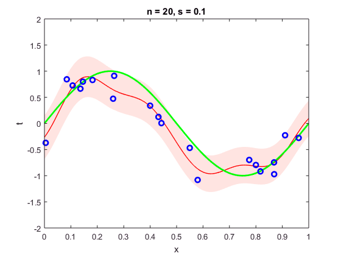
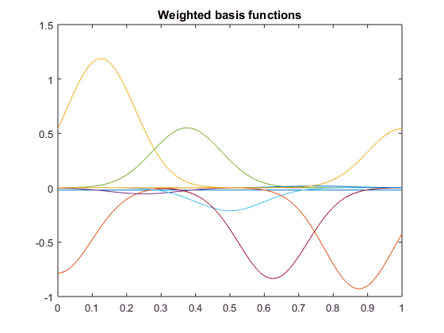

# BayesianLinearRegression.github.io
Small private exercise to recreate Bayesian Linear Regression plots from Christopher M. Bishop - Pattern Recognition and Machine Learning p. 157-158

Viewed best on https://nantero1.github.io/BayesianLinearRegression/

